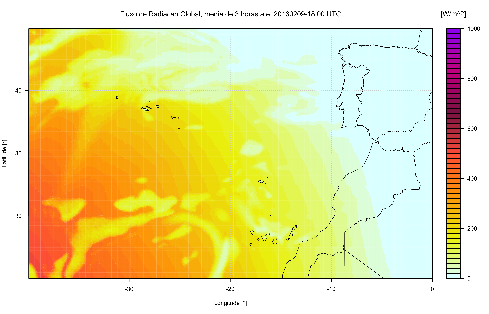
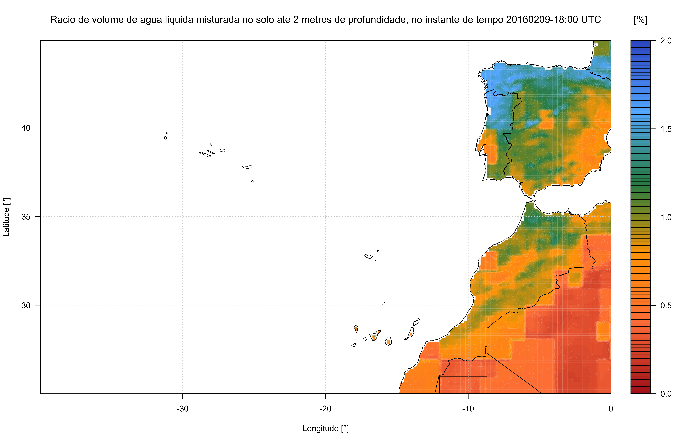

# Forecasting
Climatic Forecasting for Portugal, Madeira & Açores islands.

Work in progress!!!

## Results:


**Animations (GIF) examples**

* Temperature


* Wind direction & speed


* Low mid high cloud layer


* Precipitation


* Relative humidity


**High quality png examples**

* Global horizontal radiation


* Soil moisture


## Usage:

* Run:
```python
make run
```

* kill application:
```python
make kill
```

Source:

WRF NMM from NCEP - gfs

Contacts:

<ricardo88faria@gmail.com>
