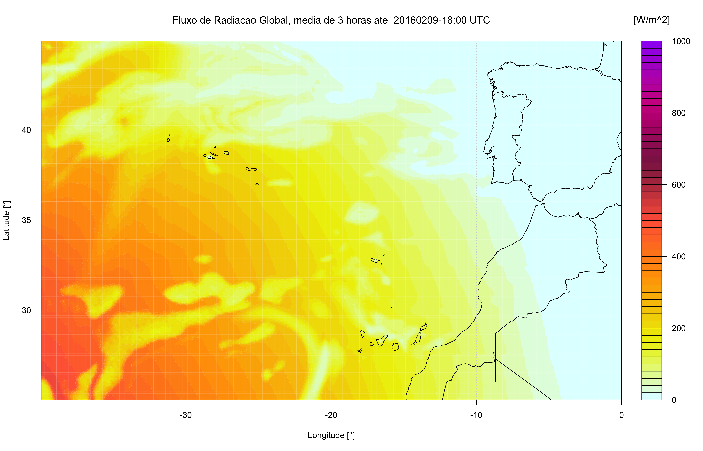
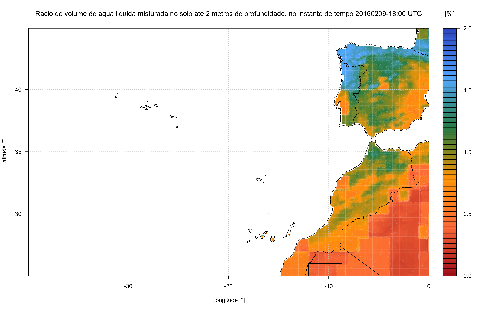

# Forecasting
Forecasting Portugal, Madeira & Açores islands

Working in progress!!!

## Results:

**Animations (GIF) examples**

* Temperature

* Wind direction & speed

* Low mid high cloud layer

* Precipitation

* Relative humidity

**High quality png examples**

* Global horizontal radiation

* Soil moisture

Contacts:
<ricardo88faria@gmail.com>
